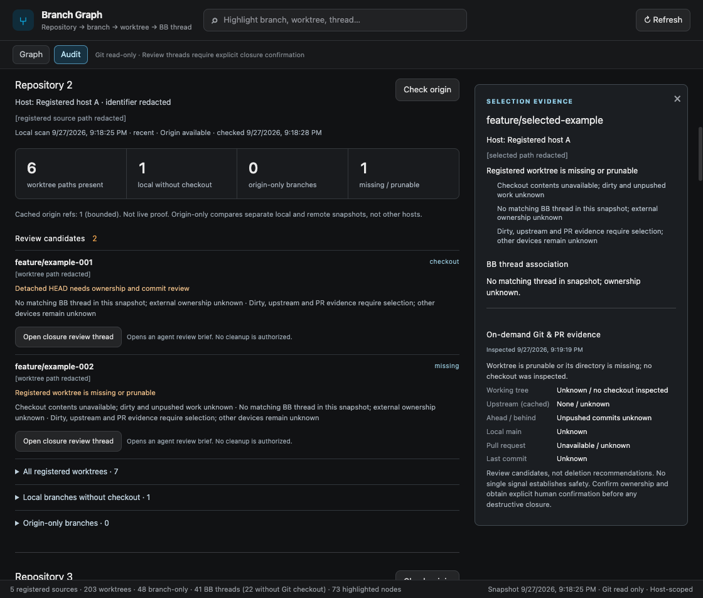
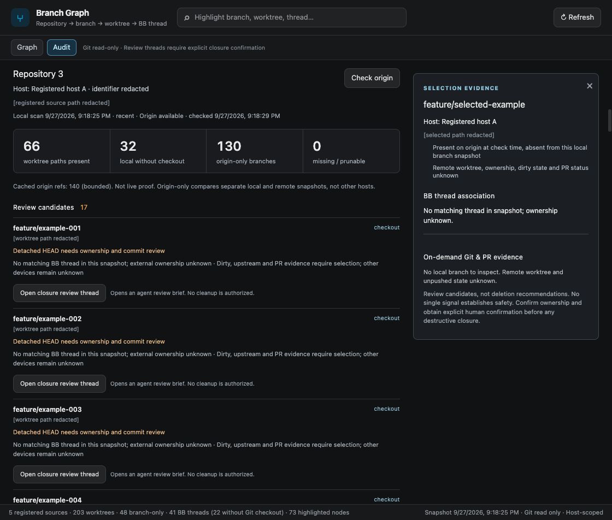

# Audit verification

## Automated checks

`npm run verify` passed: TypeScript (`tsc --noEmit`), `bb plugin build .`, and all 15 Node/React tests. `git diff --check` passed.

Coverage includes host-local classification, missing/prunable and detached evidence, stale/unavailable origin, safety copy, unusual worktree paths, invalid project/host/target rejection, concurrent and persisted closure reuse, uncertain spawn, delayed environment assignment, open failure, and narrow-screen selection scrolling.

## Live BB checks

Verified the actual installed feature source on five registered sources:

| Anonymized source | Present directories | Local without checkout | Missing/prunable | Live origin-only |
| --- | ---: | ---: | ---: | ---: |
| Repository 1 | 5 | 2 | 0 | 0 |
| Repository 2 | 6 | 1 | 1 | 0 |
| Repository 3 | 66 | 32 | 0 | 130 |
| Repository 4 | 124 | 13 | 0 | 21 |
| Repository 5 | 1 | 0 | 0 | 58 |

- Graph keeps its full node inventory when focus highlights change and while switching views.
- Origin checks were explicitly initiated; no fetch/prune was used.
- Missing/prunable selection shows dirty/unpushed/PR evidence as unknown rather than clean.
- Origin-only selection explicitly states that there is no local branch to inspect and remote worktree/ownership remains unknown.
- Closure review created a thread in the verified project/host environment. After plugin reload, reopening returned the same thread with `reused: true`, `error: null`, and no UI alert.
- At an 860px viewport, selecting evidence scrolls the stacked inspector into view; measured panel top was 157.53px with no horizontal Audit overflow.

## Privacy-safe captures

These are actual live Audit captures. Repository/host identifiers, branch names and paths were replaced in the browser DOM with explicit placeholders before capture; the surrounding BB sidebar was excluded. Counts, evidence wording, controls and layout are unchanged. This is anonymized evidence, not an unmodified screenshot or synthetic data fixture.

## Boundaries and pending gates

No branch/worktree cleanup, remote deletion, release/tag change, marketplace update or merge was performed. The installed local plugin points to the feature worktree for review; the released tag remains unchanged.

The SDK has no read-only thread-spawn permission mode. The review brief forbids Git writes and requires explicit human confirmation before closure; it is not a filesystem sandbox. Auth/network failure paths and delayed environment assignment are covered by automated fixtures, not a live induced outage. Independent approval and the release owner's new immutable semver/marketplace update remain pending.
